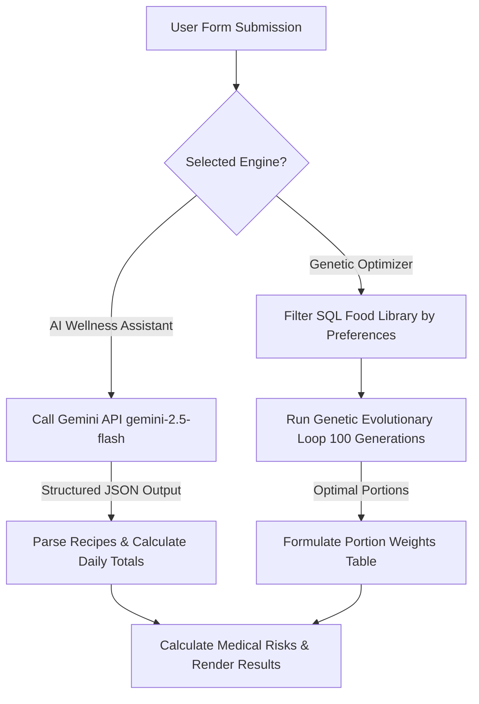
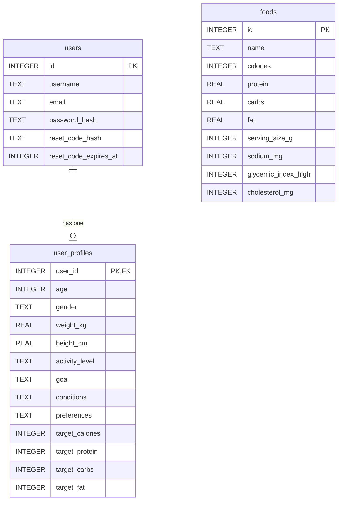

# Meal Matcher: Multi-Condition AI & Genetic Portion Meal Planner

#### **Created by:** Asma Essaedi


---

## 🍽️ Project Overview

**Meal Matcher** is a responsive, web-based clinical dietary management and wellness application built to bridge the gap between simple calorie tracking and medical nutrition therapy. Unlike generic diet tracking tools, Meal Matcher calculates daily nutritional targets based on user biometrics and dynamically applies medical guardrails for users managing chronic health conditions.

To achieve this, the application implements a unique **Dual-Engine Planning Architecture**:
1. **AI Wellness Assistant**: Uses the modern Google GenAI SDK (`gemini-2.5-flash`) via structured JSON schema instructions to generate custom, delicious meal recipes (breakfast, lunch, dinner, and snack) tailored to medical conditions, dietary preferences, and macro targets.
2. **Genetic Portion Optimizer**: An evolutionary genetic algorithm built in Python that acts as a secure local backup. It selects a combination of foods from a local SQLite database and optimizes their serving weights (in grams) across 100 generations to mathematically minimize calorie and macronutrient errors while avoiding medical trigger foods.

---

## 🚀 Key Features

*   **Secure Authentication & Account Recovery:** Features email-based logins with secure password hashing (`PBKDF2` with `SHA-256` salt via Werkzeug). Implements a production-grade password recovery flow supporting both **6-digit SMTP email verification codes** (15-minute expiry) and **signed URL recovery tokens** (1-hour expiry via `itsdangerous`).
*   **Dynamic Physical Metric Calculator:** Implements the clinical **Mifflin-St Jeor Equation** on the frontend to calculate the user's Basal Metabolic Rate (BMR) and Total Daily Energy Expenditure (TDEE). Recommended macro targets update instantly as the user modifies their age, weight, height, activity level, or wellness goal.
*   **Multi-Condition Medical Guardrails:** Enforces deterministic constraint checks and prompts for seven major health conditions:
    *   **Type 2 Diabetes & Gestational Diabetes:** Blocks high-glycemic index foods and caps daily carbohydrate ratios.
    *   **Hypertension:** Limits daily sodium consumption to under 1500mg.
    *   **Chronic Kidney Disease (CKD):** Strictly caps daily protein intake at a medical maximum of 60g, overriding high-protein preferences to prevent renal strain.
    *   **High Cholesterol:** Restricts daily cholesterol to under 200mg.
    *   **Celiac Disease:** Strictly filters out and prevents the inclusion of ingredients containing gluten.
    *   **IBS (Low FODMAP):** Excludes gas-producing carbohydrates (e.g., lentils, beans, onions, and garlic).
*   **Automated Medical Risk Evaluation:** Analyzes the final generated meal plans against the user's selected medical conditions. If any potential health trigger is detected, high-visibility clinical warning cards are shown on the results page detailing the nutritional rationale.
*   **Interactive Recipe Cards & Multimedia Integration:** Generated plans feature programmatic Unsplash food photography mapping, prep times, ingredients, instructions, and instant YouTube recipe walkthrough query shortcuts.
*   **High-End Responsive Design:** Clean, modern interface designed from scratch using custom CSS properties, glassmorphic panel containers, fluid responsive grids, transition animations, and user-friendly async button loaders to prevent double-submitting during AI calculations.

---

## 🛠️ Architecture & Technical Execution

### The Two Planner Engines



#### 1. AI Wellness Assistant (Gemini Engine)
When utilizing the AI Wellness Assistant, the application constructs a comprehensive system instruction including the user's physical parameters, target macros, custom prompts, and clinical instructions. It requests a structured response matching a strict JSON schema. The engine processes the response into four distinct recipe cards (Breakfast, Lunch, Dinner, Snack) with exact ingredient and instruction breakdowns.

#### 2. Genetic Portion Optimizer (Local Evolutionary Fallback)
If the Gemini API is offline, or if the user chooses local optimization, the app runs an evolutionary algorithm.
*   **Chromosome Representation:** A list of food items, each carrying a dynamically mutated weight property (`grams`).
*   **Fitness Evaluation Function:** Calculates the absolute deviation of the cumulative nutrients from target metrics, applying massive penalties (e.g., `+15000` to `+30000` to the error score) if constraints are violated (e.g., exceeding 60g protein for CKD, including gluten for Celiac, or sodium > 1500mg for Hypertension).
*   **Selection & Breed Cycle:** Keeps the top 20% fittest configurations, performs single-point crossovers to create child configurations, and applies a 20% mutation probability to alter ingredient weights.

---

## 🗄️ Database Schema

The SQLite database (`meal_matcher.db`) is structured with three primary tables to manage credentials, wellness profiles, and food items:



---

## 📁 File Structure & Descriptions

Below is a walkthrough of the files included in the project directory:

```
cs50x_final_project/
├── meal_matcher/
│   ├── .env                    # Configures secret keys, API credentials, and SMTP settings.
│   ├── app.py                  # Main Flask application controller handling routes, sessions, and APIs.
│   ├── helpers.py              # Implementation of the Genetic Algorithm and fitness functions.
│   ├── meal_matcher.db         # SQLite database storing users, profiles, and foods.
│   └── requirements.txt        # Defines all required Python dependency packages.
├── static/
│   ├── script.js               # Client-side validation and loading states.
│   └── styles.css              # Custom styling, fonts, and responsive grid layouts.
└── templates/
    ├── forgot_password.html    # Password reset code request form.
    ├── index.html              # Main dashboard to trigger meal planning.
    ├── layout.html             # Base layout template with navbar, footer, and flash messages.
    ├── login.html              # Secure user login portal.
    ├── profile.html            # Health profile dashboard (Mifflin-St Jeor metric calculator).
    ├── register.html           # User registration form.
    ├── reset_password.html     # Security code reset page.
    └── results.html            # Output results rendering recipes, totals, and risk warnings.
```

### File Details
*   **`meal_matcher/app.py`:** Controls application routing. Manages logins, signups, profile updates, and the secure password reset flow. Contains clinical rule triggers like `calculate_meal_risks` and manages calls to the Google Gemini API.
*   **`meal_matcher/helpers.py`:** Holds the genetic algorithm logic. Contains the evolutionary loop (`run_genetic_algorithm`), fitness function (`calculate_fitness`), and ingredient portion generators.
*   **`templates/layout.html`:** The standard template defining page hierarchy, navigation bar, alerts, and stylesheet integration.
*   **`templates/profile.html`:** Features the profile management form. Contains embedded JavaScript to calculate BMR and TDEE on the fly, auto-populating recommended macronutrient goals.
*   **`templates/index.html`:** Renders the dashboard screen showing current wellness metrics and input controls for medical conditions, macro overrides, and custom requests.
*   **`templates/results.html`:** Displays the finalized nutrition plan. Formats either the 4 AI recipes or the Genetic Optimizer weight spreadsheet, alongside comparison charts showing actual intake vs targets and active risk warnings.
*   **`static/styles.css`:** A custom CSS system written with a modern aesthetic, containing fluid styling, animations, responsive breakpoints, and glassmorphic elements.
*   **`static/script.js`:** Prevents form resubmission by disabling buttons and changing button labels dynamically upon submission.

---

## 🎨 Design Choices & Rationales

1.  **Flask & SQLite (Python):** Flask was chosen as the framework due to its lightweight nature, allowing us to implement a custom dual-engine planner and database structure. SQLite provides a self-contained, serverless data store ideal for project portability.
2.  **Dual-Engine Architecture (Generative + Genetic):** LLMs excel at generating creative, chef-style recipes but occasionally struggle with precise multi-constraint mathematical optimizations. Conversely, genetic algorithms are excellent at math and logic constraint satisfaction but cannot write readable recipes. Combining them provides the best of both worlds, with the genetic algorithm serving as a portion-balancing fallback.
3.  **Local SMTP Fallback:** When a mail server is not configured in the `.env` file, the application logs the recovery code to the command terminal. This ensures password recovery can still be tested and graded in a local development environment.
4.  **Programmatic Multimedia:** Programmatically mapping user recipes to beautiful Unsplash images based on title keywords and adding a YouTube cooking search query shortcut allows the application to remain fast and lightweight while maintaining a premium appearance.

---

## ⚙️ Installation & How to Run

### Prerequisites
*   Python 3.10 or higher.
*   A Google Gemini API key.

### Setup Steps
1.  **Navigate to the project directory:**
    ```bash
    cd cs50x_final_project
    ```
2.  **Create and activate a virtual environment:**
    ```bash
    python3 -m venv .venv
    source .venv/bin/activate
    ```
3.  **Install the required dependencies:**
    ```bash
    pip install -r meal_matcher/requirements.txt
    ```
4.  **Configure environment variables:**
    Rename or create a `.env` file inside `meal_matcher/` and enter your credentials:
    ```ini
    GEMINI_API_KEY="your_actual_gemini_api_key_here"
    SECRET_KEY="choose_a_long_random_string_for_sessions"

    # Optional Email Settings (Will log to console if left blank)
    MAIL_SERVER="smtp.gmail.com"
    MAIL_PORT=587
    MAIL_USE_TLS=true
    MAIL_USERNAME="your_email@gmail.com"
    MAIL_PASSWORD="your_app_specific_password"
    MAIL_DEFAULT_SENDER="Meal Matcher Support <your_email@gmail.com>"
    ```
5.  **Run the Flask development server:**
    ```bash
    cd meal_matcher
    flask run
    ```
6.  **Access the application:**
    Open your web browser and navigate to `http://127.0.0.1:5000/`.
```

***

### Summary of what was analyzed to build this README:
- **`app.py`**: Explored all Flask routes (`/register`, `/login`, `/forgot_password`, `/reset_password`, `/profile`, `/results`, `/`), session keys, helper integrations, SMTP mailing functions, database queries, and the structured system instruction schema passed to Google's GenAI client.
- **`helpers.py`**: Inspected the core mathematical structure of the Genetic Portion Optimizer. Reviewed parameters like generations (100), population size (50), mutation chances (20%), and custom fitness scoring formulas reflecting physical medical guardrails (CKD protein caps, Diabetes glycemic counts, IBS exclusions, Celiac gluten violations, and Hypertension sodium thresholds).
- **Templates & Static Assets**: Reviewed metrics and inputs from `profile.html` (including Mifflin-St Jeor calculation parameters), UI forms in `index.html`, visual layout rules in `layout.html`, recipe card outputs mapping programmatically to Unsplash keywords in `results.html`, and CSS/JS integrations.